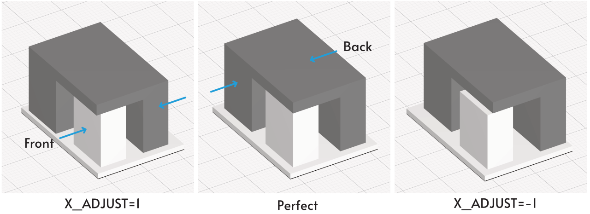

This document provides **general** information on configuring and
calibrating a standard IDEX printer. Klipper has support for very
complex IDEX configurations, with multiple hotends and extruders on a
single carriage, independent or grouped cooling fans, and much more,
which are not covered in this document.

# General configuration
Start with studying, and possibly using parts of the [example config](../config/sample-idex.cfg)
for IDEX printers. It has some distinct items that you may or may not
wish to use.
* Definition for `dual_carriage` on the X-axis, which you can change to
be on the Y axis if that is how your printer is configured.
* Sample macros for parking and switching toolheads. You should check
these to make sure they make sense for your setup and update the
position values with those that match your printer
* Fan configurations mentioned later.
* A macro for calibrating carriage separation described later in this
document.

# Tuning
If you want to use both extruders to print different features of a
single object, Klipper will need to know the positions of the extruders
relative to each other.

Because Klipper configures this by the endstop position, you will
need to calibrate your [rotation distance](Rotation_Distance.md) first.

For the finest accuracy, you should consider calibrating the homing
[endstop phase](endstop_phase.md) of your dual_carraige axis motors.

## Step 1 (~5mm)
Start by literally eyeballing it. Put a piece of tape on your bed or
use a line or other graphic already on your bed as a reference point.

Move the first carriage to this point and note it's position. Then,
park carriage 1, and move carriage 2 to the same physical position.
Note it's position (where Klipper "thinks" it is) and calculate the
difference.

In a standard setup where the carriages home to the sides with the
primary on the left, you move the logical coordinate system for the
secondary extruder to the right by lowering it's `position_endstop`
value.

Run `SET_SEPARATION Y={your calculated value}` to set the Y offset.

Once you are within a few mm of accuracy, proceed to step 2

## Step 2 (~1mm)
Configure the `calibrate_separation` macro in [the sample config](../config/sample-idex.cfg)
for your bed size and dual_carriage axis, and add heating commands to
it for the filament you'll be using.

Load filament in both extruders, and run the macro.

The test with the standard axis configuration should look as follows:


Note the lines should be colinear. If they are not, adjust your
`position_endstop` setting as noted in step 1. Once they are visually
aligned, proceed to step 3.

At this point you should re-tune your mins and maxes for each axis when
the other is parked by issuing slow, small movements until they
collide.

## Step 3 (~.1 - .025mm)
While the measuring process of this step accounts for symmetric
horizontal expansion, you will likely achieve better results by
calibrating the flow, temperature, and pressure advance for the
filament you'll be using first. You'll also do better with a filament
that is known to have better dimensional stability. Look for filaments
that can be printed without a heated bed.

Use a slicer to generate g-code for the multi-part print found in
[docs/prints/calibrate_idex.stl](prints/calibrate_idex.stl).
Align the long direction of the print perpendicular to the axis of your
`dual_carriage`. Configure your slicer to print the upper part using
the right extruder. I highly recommend using identical filaments printed with
the same temperature, etc. Use a rather coarse layer height since you
have not yet calibrated your Z offset. Print the object.

Use calipers or better, a micrometer to measure the 2 measureing points
(refer to the image below). Complete the following table:

| Part | Measurement | Calculation |
|:--:|:--:|:--:|
| Front | (mm) | 20 - (mm) |
| Back  | (mm) | (mm) - 20 |
| Offset |  | ^ Average ^ |



You should be left with the adjustment that should be made to compensate
for any alignment error. Save this to the printer by running:
```
SET_SEPARATION X_ADJUST={your calculated value}
```

Repeat this step if nessesary until you are happy with the alignment. Rotate
the object 90 degrees and repeat with the Y axis.

## Step 4 (required for high quality printing)
To print with low layer thicknesses, you'll probably find that the error
between your nozzles in the Z axis is more than your layer height itself.

Start with a piece of paper and switch between the extruders until the pressure
feels roughly the same on both extruders. Make sure you're testing the exact
same point on your bed.

Prepare to print a square about 10x10x5mm. Slice the object twice with the only
difference being which extruder is used. MAKE SURE IT IS IN THE SAME PLACE ON YOUR BED.

Use calipers or better, a micrometer to measure the height of the two samples and
adjust the Z offset as nessesary.

# Next steps
Configure a homing override to make sure that the inactive carriage is
fully parked in all scenarios.

If you want to use [input shaping](Resonance_compensation.md),
calibrate the input shaper for each carriage separately and add g-code
to your `T0` and `T1` etc commands to configure the input shaper when
the active carriage changes.

For support with Fluidd, SuperSlicer, consider overriding the `ACTIVATE_EXTRUDER`
command to run T0, T1.

If your printer has multiple part cooling fans, create `[fan_generic]` sections
for each of them. For support with Klipper's default LCD resdout, consider using the
`[fan]` section and macro elements in the sample. Otherwise, write your own M106
and M107 macros.

Print a few objects to ensure everything is working as expected!
