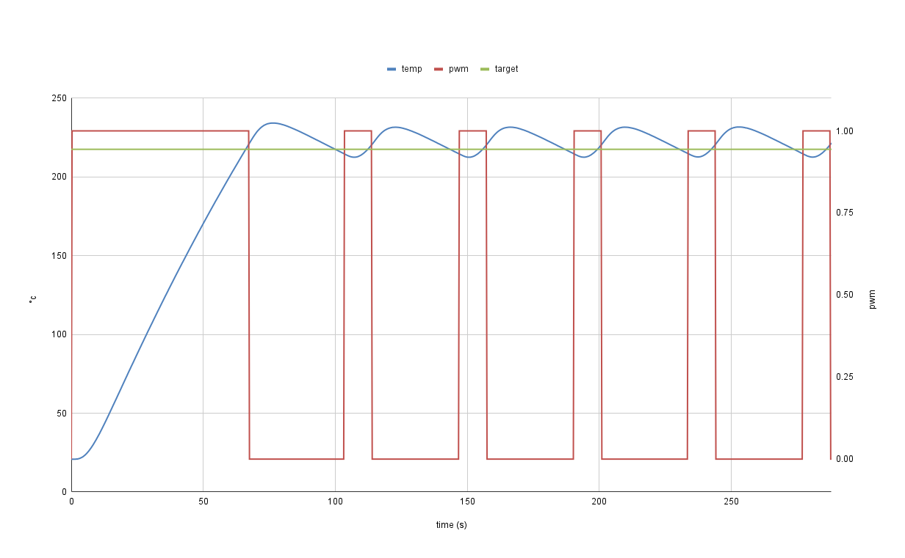
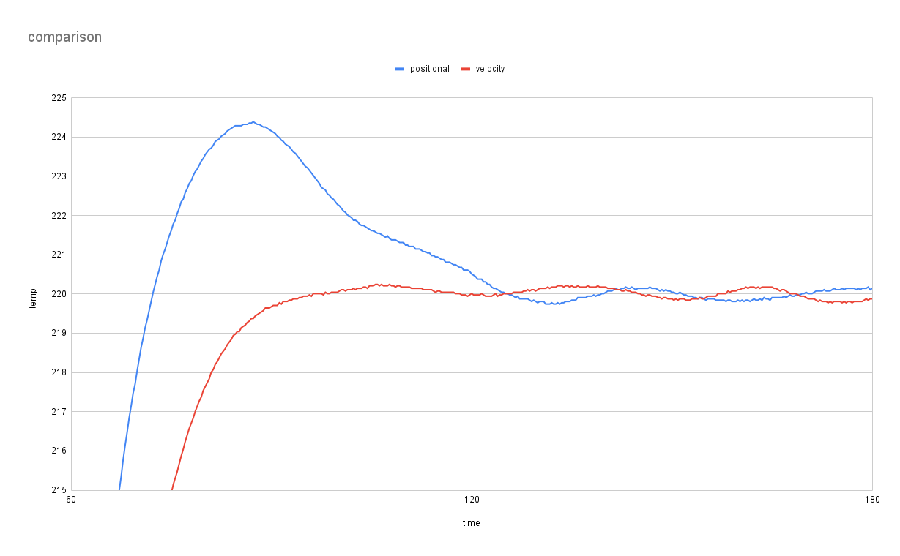

# PID
PID control is a widely used control methodology in the 3d printing world.
It’s ubiquitous when it comes to temperature control, be it with heaters for
generating heat, or fans for removing it. The goal of this document is to
provide a high level overview of what PID is, and how to best leverage it in
Klipper.

### History

The first rudimentary PID controller was developed by Elmer Sperry in 1911 to
automate a ship's rudder control. Engineer Nicolas Minorsky published the first
mathematical analysis of a PID controller in 1922. In 1942 John Ziegler &
Nathaniel Nichols published their groundbreaking paper
“Optimum Settings for Automatic Controllers” that layed out a trial and error
method for tuning a pid controller commonly referred to as the
“Ziegler-Nichols Method” today.

In 1984 Karl Astrom and Tore Hagglund published their paper “Automatic Tuning
of Simple Regulators with Specifications on Phase and Amplitude Margins”. In
the paper they introduced an automated tuning methodology commonly referred to
as the “Astrom-Hagglund method” or the “Relay method”.

In 2019 Brandon Taysom & Carl Sorensen published their paper "Adaptive Relay
Autotuning under Static and Non-static Disturbances with Application to
Friction Stir Welding", that laid out a method to generate more accurate
results from a relay test. This is the PID calibration method currently used by
Klipper.

### PID Calibration

As previously mentioned Klipper uses a relay test for calibration purposes. A
standard relay test is conceptually simple. You turn the heater's power on and
off to get it to oscillate about the target temperature, as seen in the
following plot.



The above plot shows a common issue with a standard relay test. If the system
being calibrated has too much or too little power for the chosen target
temperature, it will produce biased and asymmetric results. As the plot above
shows, the system spends more time with the power off, and has a greater
amplitude above the target temperature than it does below.

In an ideal system, both power on and off time, as well as the amplitude above
and below the target temperature would be equal. 3d printers don’t actively
cool the hot end or bed, so they can never reach the ideal.

The following plot is a relay test that uses the methodology laid out by
Taysom & Sorensen. After each iteration, the data is analyzed, and a new
maximum power setting is calculated. As can bee seen from the plot, the system
starts the test asymmetric, but ends it very symmetric.


 A topic that’s not often discussed in the 3dp community is the conditions in
 which calibration should be performed. When a calibration test is performed
 external variables should be minimized as much as possible, as the goal of the
test is to model the system in steady state conditions free of external
disturbances. For example, if you are calibrating a hot end, you do not want a
bed or chamber heater actively heating up or cooling down. You want them off,
or holding at their target temperature. Part cooling and chamber fans can also
be problematic, as they can cause temperature fluctuations in the hot end.

### Pid Control Parameters

Many methods exist for calculating control parameters, such as Ziegler-Nichols,
Cohen-Coon, Kappa-Tau, Lambda, and many more. By default, classical
Ziegler-Nichols parameters are generated. If A user wants to experiment with
other flavors of Ziegler-Nichols, or Cohen-Coon parameters, they can extract
the constants from the log as seen below and feed them into this
[spreadsheet](resources/pid_params.xls).

```
Ziegler-Nichols constants: Ku=0.103092 Tu=41.800000
Cohen-Coon constants: Km=-17.734845 Theta=6.600000 Tau=-10.182680
```

Classical Ziegler-Nichols parameters work in all scenarios. Cohen-Coon
parameters work better with systems with a large amount of dead time/delay.
For example, if a printer has a large thermal mass bed that’s slow to heat up
and stabilize, Cohen-Coon parameters will generally do a better job at
controlling it.

### Pid Control Algorithms

Klipper currently supports two control algorithems positional, and velocity.
The fundamental difference between the two algorithms is as follows. The
positional algorithm calculates what the PWM value should be for the current
time interval. The velocity algorithm calculates how much the previous PWM
setting should be changed by, to get the PWM value for the current time
interval.

Positional is the default algorithm, as it will work in every scenario. The
Velocity algorithm can provide superior results to the Positional algorithm,
but requires lower noise sensor readings, or a larger smoothing time setting.

The most noticeable difference between the 2 algorithms is that given the same
configuration parameters velocity control will eliminate or drastically reduce
overshoot as seen in the plots below, because it is not susceptible to integral
wind-up.




In some scenarios Velicty control will also be better at holding the heater at
its target temperature, and rejecting disturbances. The primary reason for this
is that velocity control is more like a standard second order differential
equation. It takes into account position, velocity, and acceleration.
