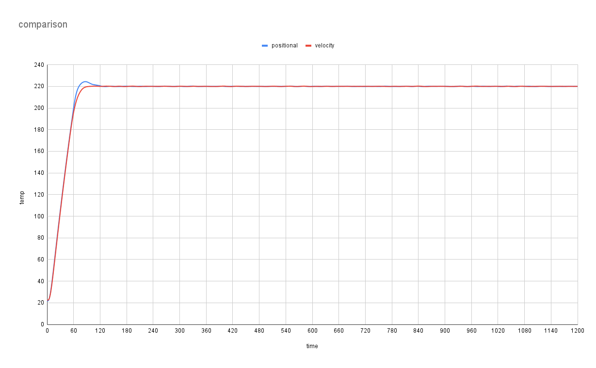

# PID

PID control is a widely used control methodology in the 3d printing world.
When it comes to temperature control it's ubiquitous whether it is using heaters
to add or fans to remove heat. The goal of this document is to provide an
overview of what PID is and how best to use it in Klipper.

## History

The first rudimentary PID controller was developed by Elmer Sperry in 1911 to
automate a ship's rudder control. Engineer Nicolas Minorsky published the first
mathematical analysis of a PID controller in 1922. In 1942 John Ziegler &
Nathaniel Nichols published their groundbreaking paper
“Optimum Settings for Automatic Controllers” that layed out a trial and error
method for tuning a pid controller commonly referred to as the
“Ziegler-Nichols Method” today.

In 1984 Karl Astrom and Tore Hagglund published their paper “Automatic Tuning
of Simple Regulators with Specifications on Phase and Amplitude Margins”. In
the paper they introduced an automated tuning methodology commonly referred to
as the “Astrom-Hagglund method” or the “Relay method”.

In 2019 Brandon Taysom & Carl Sorensen published their paper "Adaptive Relay
Autotuning under Static and Non-static Disturbances with Application to
Friction Stir Welding", that laid out a method to generate more accurate
results from a relay test. This is the PID calibration method currently used by Klipper is used.

## PID Calibration

As previously mentioned Klipper uses a relay test for calibration purposes. A
standard relay test is conceptually simple. You turn the heater's power on and
off to get it to oscillate about the target temperature as seen in the
following plot.


The above plot shows a common issue with a standard relay test. If the system
being calibrated has too much or too little power for the chosen target
temperature, it will produce biased and asymmetric results. As the above diagram shows, the system spends more time in the off state and has a larger amplitude above the target temperature than below.

In an ideal system, both the on and off times and the amplitude above and below the
target temperature would be the same. 3D printers do not actively cool the hot end
or bed, so they can never reach the ideal state.

The following is a relay test based on the methodology used by Taysom & Sorensen. After each iteration, the data is analyzed and a new maximum power setting is calculated. As can be seen from the diagram, the system starts out asymmetrical at the beginning of the test, but becomes very symmetrical at the end.


One topic that is not often discussed in the 3dp community is the conditions under
which calibration should be performed. When performing a calibration test,
external variables should be minimized as much as possible, since the goal of
the test is to model the system under stable conditions and without external disturbances.
For example, when calibrating a hot end, you do not want a bed or chamber heater
actively heating up or cooling down. You want them to be turned off or kept
at the target temperature. Part cooling and chamber fans can also be problematic
because they can cause temperature fluctuations in the hot end.

## Pid Control Parameters

Many methods exist for calculating control parameters, such as Ziegler-Nichols,
Cohen-Coon, Kappa-Tau, Lambda, and many more.
By default, classical Ziegler-Nichols parameters are generated.
If a user wants to experiment with other variants of Ziegler-Nichols or Cohen-Coon parameters,
he can extract the constants from the protocol (see below) and enter them into the following table.
[spreadsheet](resources/pid_params.xls).

```text
Ziegler-Nichols constants: Ku=0.103092 Tu=41.800000
Cohen-Coon constants: Km=-17.734845 Theta=6.600000 Tau=-10.182680
```

Classical Ziegler-Nichols parameters work in all scenarios. Cohen-Coon
parameters work better with systems with a large amount of dead time/delay.
For example, if a printer has a bed with a large thermal mass that is slow
to heat up and stabilize and stabilize, the Cohen-Coon parameters can generally control better.

## Pid Control Algorithms

Klipper currently supports two control algorithms: Position and Velocity control. The basic difference between the two algorithms is as follows. The position algorithm calculates how high the PWM value should be for the current time interval. The velocity algorithm calculates by how much the previous PWM setting must be changed to obtain the PWM value for the current time interval.

Positional is the default algorithm because it works in every scenario. The Velocity algorithm can give better results than the Positional algorithm, but requires less noisy sensor readings or more smoothing time.

The most noticeable difference between the two algorithms is that for the same configuration parameters, velocity control eliminates or drastically reduces overshoot, as seen in the graphs below, as it is not prone to integral buildup.




In some cases, velocity control is also better at keeping the heater at its target
temperature and suppressing disturbances. The main reason for this is that velocity
control is more like a standard second order differential equation.
This takes into account position, velocity and acceleration.
